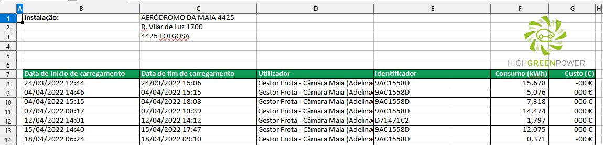

# Carregamentos da frota de veículos eléctricos #
<em>Dados obtidos a partir da plataforma "High Green Power" (HGP) https://mobility.highgreenpower.pt/</em>

### Overview ###

A plataforma HGP gere um conjunto de carregadores de veículos eléctricos distribuídos em vários pontos do Concelho.
Esta plataforma entrou em funcionamento em finais de Fevereiro de 2022.
Pelo acesso à plataforma [HGP](https://mobility.highgreenpower.pt/), é possível extrair relatórios de consumo / carregamento dos veículos eléctricos, como explicitado abaixo.

Até Maio de 2023, a plataforma reportava seis pontos de carregamento referidos como:
- Torre do Lidador
- Oficinas
- Polícia Municipal
- Quinta da Gruta
- Praça Central

Em Julho de 2023, a plataforma reportava (além dos anteriores) mais quatro locais de carregamento:
- USF Alto da Maia
- USF Lidador
- USF Pedras Rubras
- USF Pedrouços

### Exportação de ficheiros xls ###

A plataforma permite exportar relatórios das sessões de carga dos veículos, em formato xls (para o ficheiro 'export.xls'), seleccionando um local de carregamento e as datas de início e fim desse relatório.
O ficheiro xls exportado apresenta o seguinte formato:

Os carregamentos não estão todos disponíveis na plataforma https://mobility.highgreenpower.pt/ porque os carregamentos efectuados nas “Oficinas” não estão a ser comunicados à plataforma.
Há uma outra plataforma de onde a Engª Adelina pode exportar a quilometragem dos veículos.

Exportação dos dados de carregamento para excel - Consumo kWh eFrota
Os dados dos carregamentos podem ser exportados para excel, obtendo ficheiros com o seguinte formato:

Importação dos dados de Excel -> BD -> Api -> Dashboard
Através de um script em Python os dados são recolhidos do ficheiro Excel e inseridos na tabela BAZE.eFrota, automaticamente, tendo esta estrutura.

Campos importados do eFrota.xls:
Carregador, Instalação, Utilizador, Identificador, Inicio (GDH do início do Carregamento), 
Campos alterados:
Nota: Estes campos foram alterados com o intuito de separar por hora os carregamentos
Duração: Por exemplo, início -> 20h17 Fim -> 22h14, foram criadas 3 linhas (20h17 -> 21h00 — 21h00 -> 22h00 — 22h00 -> 22h14)

Consumo. Por exemplo, Início -> 20h17 Fim -> 22h14 — Foi calculado o consumo por segundo. Assim, cada linha tem o consumo por cada hora. O somatório das 3 linhas espelha o total consumido.
Campos referentes ao ficheiro:
Linha (nº da linha do registo no xls)
Filename
Campos adicionados
Fim(Fim do carregamento -> início + duração)
horaInicio (nº da hora de início do carregamento (int))
GHDInicioCarr (Grupo Data Hora do inicio do carregamento 
Api pode ser acedida através do link:
http://10.10.10.32/D4CMMaia/eFrota_api.php ou
http://10.10.10.32/D4CMMaia/eFrota_api.php?instalacao=Edifício da Torre do Lidador
 (por exemplo)
Irá ser retornado um JSON com a estrutura abaixo e com os dados dos últimos 3 dias em registo na bd. Visto que os dados não são recebidos em tempo real, verifica-se qual é o último registo que está na bd.

Podemos visualizar os dados através do link abaixo.
http://10.10.10.32/D4CMMaia/eFrota.htm

É também disponibilizado um 2º gráfico com o acumulado do consumo, desde que temos registo, de todas as instalações agrupado por hora.

Importação dos dados de Excel -> BD -> Api -> Dashboard - Odômetro eFrota
O ficheiro Excel.xlsx disponibilizado com os valores de Km percorridos pelas viaturas eFrota tem a seguinte estrutura:
